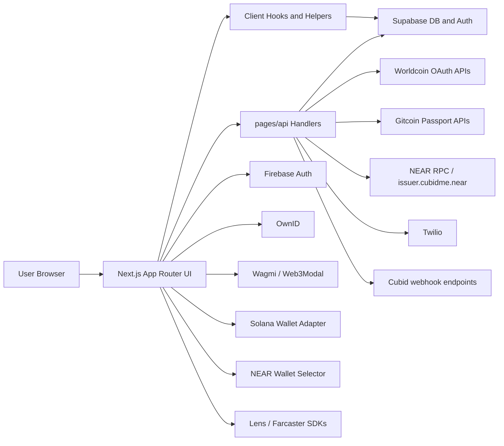
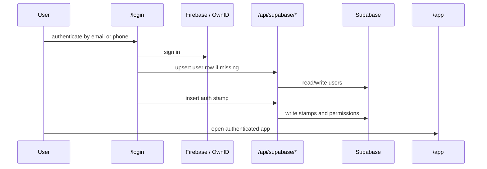

# Cubid Passport Current-State Architecture

Last updated: 2026-04-15

## Purpose

This document describes the current implementation architecture of the `cubid-passport` repository as it exists today. It is based on the checked-in code, not an aspirational target design.

## System Summary

Cubid Passport is a hybrid Next.js 14 application that lets end users:

- authenticate with email, phone, and several social or identity providers
- collect "stamps" that represent identity proofs and connected accounts
- share selected stamps with third-party dapps through allow-list flows
- create or link blockchain accounts across EVM, Solana, and NEAR
- mint a Gitcoin Passport score onto NEAR as an SBT

The repository combines:

- App Router pages under `app/`
- legacy API routes under `pages/api/`
- a client-heavy React shell with many global providers
- direct Supabase database access from both browser code and server handlers
- blockchain and identity-provider integrations embedded across UI components and API endpoints

## High-Level Topology

## Repository Layout

### Frontend

- `app/`
  UI routes for landing, login, authenticated app, allow flow, widget flow, Worldcoin callback, Telegram flow, and PII flow.
- `components/`
  Shared UI plus large feature components for stamps, profile, minting, auth wrappers, and wallet integrations.
- `hooks/`
  Browser hooks for auth, stamp loading, and app-id resolution.
- `redux/`
  Minimal Redux store for authenticated user state.
- `config/`
  Site config plus Wagmi connector config.
- `styles/`
  Global Tailwind styles.

### Backend and Shared Logic

- `pages/api/`
  All server endpoints. This includes generic Supabase CRUD handlers, dapp APIs, wallet flows, verification flows, webhooks, and third-party callbacks.
- `lib/`
  Shared browser/server helpers for Supabase, Firebase, stamp insertion, NEAR wallet handling, hashing, and outbound webhook triggers.

## Runtime Architecture

## Frontend Shell

The root shell is defined in [app/layout.tsx](/Users/botmaster/src/cubid/cubid-passport/app/layout.tsx).

Current traits:

- The layout is a client component.
- It initializes a large set of providers globally:
  - `SessionProvider` for NextAuth
  - `SolanaAppWalletProvider`
  - `WagmiProvider`
  - `QueryClientProvider`
  - `LensProvider`
  - `AuthKitProvider` for Farcaster
  - `OwnIDInit`
  - Redux `Provider`
  - theme and toast providers
- It eagerly starts the custom NEAR wallet helper from `lib/nearWallet.ts`.
- It contains `window` and `localStorage` dependent routing logic in the layout itself.

Practical consequence:

- The application is effectively client-first, even though it runs inside Next.js.
- Build-time warnings already show browser-only assumptions leaking into prerendered code paths.

## Route Model

### App Router Pages

Key routes under `app/`:

- `/`
  Landing page and Fractal callback handling.
- `/login`
  Email and phone authentication flow.
- `/app`
  Main authenticated experience with tabs for profile, stamps, about, and NEAR SBT minting.
- `/allow`
  Dapp-facing consent flow for sharing required and optional stamps.
- `/widget-allow`
  Social-provider callback helper for embedded allow flows.
- `/worldcoin`
  Worldcoin OAuth callback page.
- `/pii`
  PII-related workflow.
- `/telegram`, `/telegram-connect`
  Telegram-related user flows.

### Legacy API Routes

All server endpoints remain under `pages/api/`. The codebase has not been migrated to App Router route handlers.

## Authentication and Session Model

Authentication is split across several systems instead of one unified auth boundary.

### Primary User Login

The main login experience in [app/login/page.tsx](/Users/botmaster/src/cubid/cubid-passport/app/login/page.tsx) uses:

- OwnID plus Firebase custom tokens for email login
- Firebase phone auth for SMS OTP login

After login:

- `hooks/useAuth.ts` listens to Firebase auth state
- basic user fields are copied into Redux
- `email`, `phone`, and guest/allow state are also mirrored into `localStorage`
- the hook looks up the matching `users` row through `/api/supabase/select`

### Social / Provider Auth

Additional provider logins happen outside the primary login flow:

- Supabase OAuth is used for social stamps such as GitHub, Google, Twitter, Discord, and similar providers
- Farcaster auth is handled through `@farcaster/auth-kit`
- Worldcoin uses a separate OAuth flow through NextAuth config and a dedicated callback page

### Guest vs Authenticated Guards

- [components/auth/guest.tsx](/Users/botmaster/src/cubid/cubid-passport/components/auth/guest.tsx) redirects signed-in users to `/app`
- [components/auth/authenticated.tsx](/Users/botmaster/src/cubid/cubid-passport/components/auth/authenticated.tsx) redirects guests to `/login` unless the allow-flow token path is active

### NextAuth Usage

NextAuth is present but narrowly used:

- [pages/api/auth/[...nextauth].ts](/Users/botmaster/src/cubid/cubid-passport/pages/api/auth/%5B...nextauth%5D.ts) defines a Worldcoin OAuth provider
- [middleware.ts](/Users/botmaster/src/cubid/cubid-passport/middleware.ts) protects `/admin` and `/me`

In practice, Firebase plus local state appears to drive the core app experience more than NextAuth.

## State Management

State is distributed across several mechanisms:

- Redux stores the current authenticated user object only.
- React local state holds most feature state.
- React Query is initialized globally but is not the primary data-fetching abstraction.
- `localStorage` is used heavily for flow state:
  - `allow-uuid`
  - `allow_url`
  - `page_id`
  - `socialName`
  - `email`
  - `phone`
  - `unauthenticated_user`

This means navigation and permissions are partly application state and partly browser storage state.

## Data Access Model

Supabase is the central system of record.

### Current Access Patterns

There are two active patterns:

1. Direct client-side Supabase usage
   - Social login in `components/stamps/index.tsx`
   - Widget allow flow in `app/widget-allow/page.tsx`
   - Shared client import from [lib/supabase.ts](/Users/botmaster/src/cubid/cubid-passport/lib/supabase.ts)

2. Generic API wrappers over Supabase
   - [pages/api/supabase/select.ts](/Users/botmaster/src/cubid/cubid-passport/pages/api/supabase/select.ts)
   - [pages/api/supabase/insert.ts](/Users/botmaster/src/cubid/cubid-passport/pages/api/supabase/insert.ts)
   - [pages/api/supabase/update.ts](/Users/botmaster/src/cubid/cubid-passport/pages/api/supabase/update.ts)
   - [pages/api/supabase/delete.ts](/Users/botmaster/src/cubid/cubid-passport/pages/api/supabase/delete.ts)

The generic CRUD endpoints accept arbitrary table names and filters from the caller. That is a major architectural characteristic of the current system.

### Inferred Core Data Model

Based on code references, important tables include:

- `users`
- `stamps`
- `stamptypes`
- `dapps`
- `dapp_users`
- `stamp_dappuser_permissions`
- `dapp_pages`
- `dapp_stamptypes`
- `stampscore_dapps`
- `stampscores_available`
- `wallet_details`
- `brightid-data`
- `near-api-accounts`
- `evm_accounts`
- `cronjobs`
- `all_blacklisted_stamps`

## Stamp Architecture

The stamp system is the core domain concept.

### Stamp Definition

Stamp type IDs are duplicated in multiple places, especially:

- [lib/stampInsertion.ts](/Users/botmaster/src/cubid/cubid-passport/lib/stampInsertion.ts)
- [pages/api/utils/stampKey.ts](/Users/botmaster/src/cubid/cubid-passport/pages/api/utils/stampKey.ts)
- feature components that keep local copies

### Stamp Write Path

The main write helper is `insertStamp` in [lib/stampInsertion.ts](/Users/botmaster/src/cubid/cubid-passport/lib/stampInsertion.ts).

What it currently does:

- resolves the stamp type
- optionally creates derived child stamps such as email or phone
- inserts the primary stamp row
- creates `stamp_dappuser_permissions`
- creates a `dapp_users` row if needed
- triggers Cubid webhook notifications

There is also a `server_insertStamp` path for API handlers to insert stamps directly from the server side.

### Permission Model

Sharing with dapps is permissioned through `stamp_dappuser_permissions`.

- allow flows load dapp-specific permission rows
- users can selectively grant stamp access during `/allow`
- the hook in [lib/insert_stamp_perm.ts](/Users/botmaster/src/cubid/cubid-passport/lib/insert_stamp_perm.ts) bridges stamp creation and permission insertion

## Main User Flows

## 1. Core Cubid Login and App Usage

The authenticated app at `/app` is a tabbed container around:

- `Profile`
- `Stamps`
- `About`
- `MintHumanity`

## 2. Stamp Collection

The stamp collection UI in [components/stamps/index.tsx](/Users/botmaster/src/cubid/cubid-passport/components/stamps/index.tsx) acts as a large orchestration layer for:

- Supabase OAuth social providers
- Gitcoin Passport
- EVM wallet connection through Wagmi/Web3Modal
- Solana wallet connection
- NEAR wallet selector
- BrightID
- GoodDollar
- Instagram
- Phone
- Farcaster
- Lens

This component directly coordinates UI state, provider SDKs, Supabase lookups, and stamp writes.

## 3. Dapp Allow Flow

The allow flow is centered on:

- [app/allow/page.tsx](/Users/botmaster/src/cubid/cubid-passport/app/allow/page.tsx)
- [pages/api/allow/fetch_allow_uid.ts](/Users/botmaster/src/cubid/cubid-passport/pages/api/allow/fetch_allow_uid.ts)

Current behavior:

- consumes `uid`, `page_id`, and `colormode` query params
- loads the requesting dapp user, page metadata, requested stamp types, and score metadata
- shows required and optional stamp sharing sections
- writes permission rows when a user approves a stamp
- redirects back to the dapp page redirect URL on submit

The embedded social widget path in [app/widget-allow/page.tsx](/Users/botmaster/src/cubid/cubid-passport/app/widget-allow/page.tsx) performs a provider login, inserts the resulting stamp, then redirects back to the requesting dapp page.

## 4. Wallet and On-Chain Identity Flows

### EVM

- Wagmi and Web3Modal handle user wallet connections.
- Gitcoin Passport data is fetched through `/api/gitcoin-passport-data`.
- `/api/get_app_scoped_EVM_public_key` can also generate and persist an app-scoped EVM wallet for a user.

### Solana

- `components/walletProvider.tsx` wires in the Solana wallet adapter.
- A connected public key is inserted as a Solana stamp.

### NEAR

- [lib/nearWallet.ts](/Users/botmaster/src/cubid/cubid-passport/lib/nearWallet.ts) wraps NEAR wallet selector.
- `/api/createnewnearacc` creates new NEAR accounts under `issuer.cubidme.near`.
- `/api/mint-sbt` mints an SBT representing a Gitcoin Passport score onto NEAR.
- `components/minthumanity/nearFlow.tsx` is the main UI for this journey.

## API Surface by Area

The API layer is broad and mostly organized by feature folder.

### Generic Data Access

- `/api/supabase/*`

### Allow and Dapp Access

- `/api/allow/*`
- `/api/dapp/*`
- `/api/v2/create_user`
- `/api/v2/identity/*`
- `/api/v2/score/*`

### Verification and Credential Collection

- `/api/verify/*`
- `/api/worldcoin/*`
- `/api/twillio/*`
- `/api/v2/twillio/*`
- `/api/v2/email/*`
- `/api/telegram/*`
- `/api/insta-data-fetch`
- `/api/fractal`

### Wallet and Blockchain

- `/api/get_app_scoped_EVM_public_key`
- `/api/createnewnearacc`
- `/api/mint-sbt`
- `/api/gitcoin-near-cron-job`
- `/api/gitcoin-passport-data`
- `/api/wallet/*`

### Webhooks and Background Behavior

- `/api/cubid-webhook/*`
- `/api/five_min_3oc_cron`

## External Integrations

The current codebase integrates with:

- Supabase
- Firebase Auth
- OwnID
- Worldcoin
- Gitcoin Passport
- NEAR RPC and NEAR wallet selector
- EVM chains through Wagmi, WalletConnect, and Web3Modal
- Solana wallet adapter
- Lens
- Farcaster Auth Kit
- Twilio
- Instagram OAuth endpoints
- Fractal OAuth endpoints

## Current Architectural Characteristics

These are not opinions about an ideal future design. They are the notable traits of the code as written today.

- The app is frontend-heavy and browser-state-heavy.
- Business logic is spread across client components, hooks, shared `lib/` helpers, and API handlers.
- There is no strong separation between presentation, orchestration, and domain logic.
- Supabase acts as the primary backend, identity store, and permissions store.
- The API layer mixes public integration endpoints, internal helper endpoints, and generic database access in the same namespace.
- App Router pages are modernized, but the backend remains fully legacy `pages/api`.

## Current Risks and Technical Debt

These are visible implementation risks that affect the current architecture.

- The root layout depends on `window` and `localStorage`, which already causes build-time browser-only warnings.
- Supabase service-role style access is imported directly into browser code through [lib/supabase.ts](/Users/botmaster/src/cubid/cubid-passport/lib/supabase.ts).
- Generic Supabase CRUD endpoints allow arbitrary table access patterns from callers.
- Authentication is fragmented across Firebase, Supabase OAuth, OwnID, Farcaster, and limited NextAuth usage.
- Stamp type mappings are duplicated across the codebase.
- Large feature components such as [components/stamps/index.tsx](/Users/botmaster/src/cubid/cubid-passport/components/stamps/index.tsx) combine UI, data loading, third-party SDK orchestration, and persistence writes.
- There are still hardcoded integration credentials and project IDs in the repo.
- Build output already shows `localStorage is not defined` warnings and a Celo dependency warning around `fs` resolution.

## Suggested Reading Order

For engineers getting oriented, this is the fastest path through the codebase:

1. [app/layout.tsx](/Users/botmaster/src/cubid/cubid-passport/app/layout.tsx)
2. [hooks/useAuth.ts](/Users/botmaster/src/cubid/cubid-passport/hooks/useAuth.ts)
3. [components/stamps/index.tsx](/Users/botmaster/src/cubid/cubid-passport/components/stamps/index.tsx)
4. [lib/stampInsertion.ts](/Users/botmaster/src/cubid/cubid-passport/lib/stampInsertion.ts)
5. [app/allow/page.tsx](/Users/botmaster/src/cubid/cubid-passport/app/allow/page.tsx)
6. [pages/api/allow/fetch_allow_uid.ts](/Users/botmaster/src/cubid/cubid-passport/pages/api/allow/fetch_allow_uid.ts)
7. [components/minthumanity/nearFlow.tsx](/Users/botmaster/src/cubid/cubid-passport/components/minthumanity/nearFlow.tsx)
8. [pages/api/mint-sbt.ts](/Users/botmaster/src/cubid/cubid-passport/pages/api/mint-sbt.ts)

## Bottom Line

Today, Cubid Passport is best understood as a client-centric identity orchestration app backed by Supabase, with a large integration layer for social proofs and blockchain account flows. The most important architectural seams are:

- stamp creation and permissioning
- dapp allow-list sharing
- hybrid auth across Firebase, Supabase OAuth, and provider SDKs
- NEAR/EVM/Solana account and proof flows

Those seams should stay central in any future refactor, because they are where the current product behavior is concentrated.
