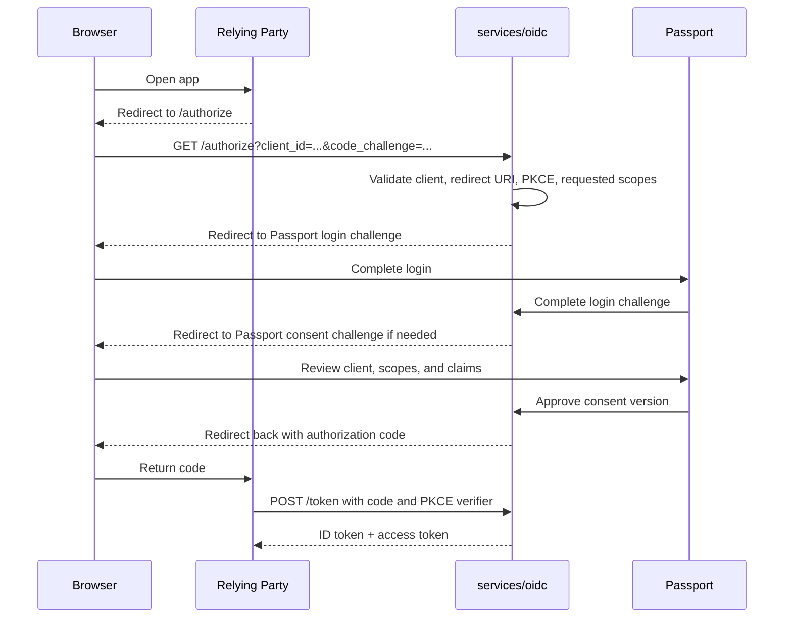
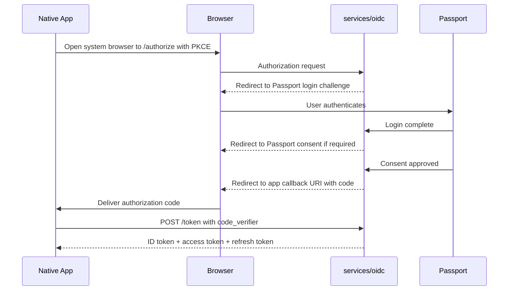
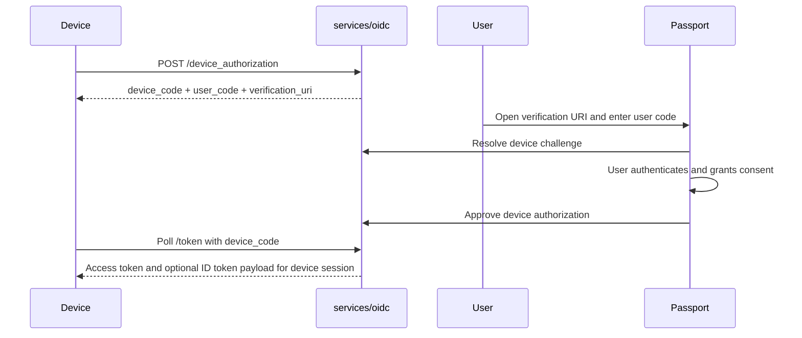
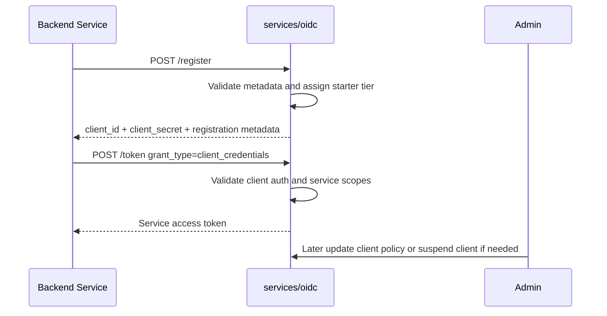
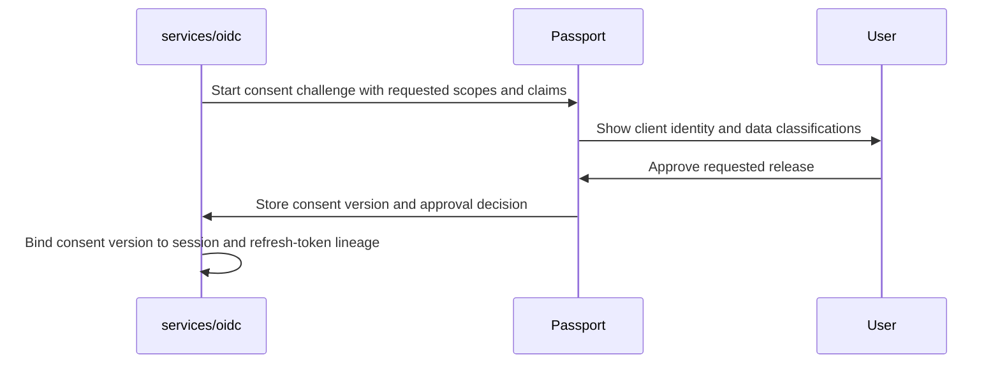
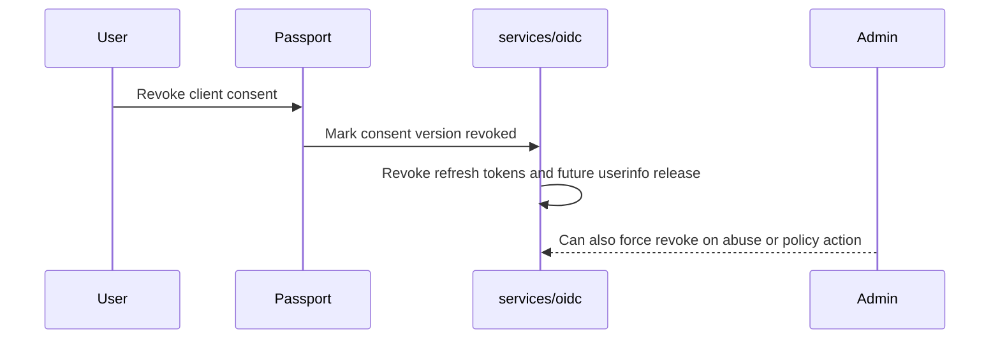
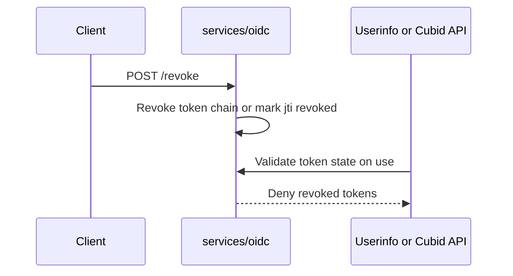

# Login with Cubid OIDC and Trust Architecture

Last updated: 2026-04-15
Status: Accepted in B01
Primary follow-up todos: B02, B03, B04, D01, E01

## Purpose

This document is the decision-complete target-state architecture for Login with Cubid as an OpenID Connect identity platform. It defines the OIDC issuer contract, trust boundaries, pairwise subject model, dynamic client registration, token and consent lifecycle, and the implementation split between Passport, Admin, and the future `services/oidc` runtime.

This document supersedes the generic OIDC notes in the monorepo operating model. B02 and later work must treat this file as the source of truth for OIDC behavior.

## Decisions at a Glance

- Cubid is the OIDC issuer.
- The stable issuer URL is `https://id.cubid.me`.
- The issuer runtime lives in `services/oidc`.
- Passport is the hosted login and consent UX.
- Admin is the client and policy control plane.
- Human users are the only end-user identity class in v1 token semantics.
- Every OIDC client receives a mandatory pairwise `sub` value derived per client.
- Dynamic client registration is open and production-enabled from day one.
- New clients start active with abuse controls and baseline quotas, not manual approval gates.
- End-user login flows use Authorization Code with PKCE.
- Native and confidential web clients may receive rotating refresh tokens.
- Device clients use Device Authorization Grant.
- Backend service clients use Client Credentials only for Cubid platform APIs.
- Implicit flow and Resource Owner Password Credentials are out of scope and unsupported.
- ID tokens and access tokens are JWTs signed by the issuer.
- Cubid-specific claims are scope-gated, policy-driven, and consent-bound.
- Tokens and userinfo never expose internal user IDs, dapp user UUIDs, or raw cross-app identifiers.

## Goals

- make Cubid usable as production OIDC infrastructure for a broad integrator set in v1
- preserve Cubid's anti-tracking and selective-disclosure principles
- give developers immediate self-serve onboarding with live production credentials
- keep Passport, Admin, and the future issuer service cleanly separated
- define shared package boundaries early enough for B02 and B03 to build on stable contracts

## Non-Goals

B01 and B02 do not include:

- passkeys or WebAuthn rollout details
- agent or organization subject semantics
- arbitrary user-defined data release
- a full operator-facing custom claim registry implementation
- non-standard login-only shortcuts that bypass OIDC semantics

## System Roles and Trust Boundaries

## Runtime Responsibilities

### services/oidc

The issuer runtime in `services/oidc` owns:

- OIDC discovery metadata
- JWK publication and signing-key rotation
- `/authorize`, `/token`, `/userinfo`, `/revoke`, `/logout`
- dynamic client registration and registration-management endpoints
- device authorization endpoints and polling state
- authorization-code issuance and PKCE verification
- JWT issuance and service-token issuance
- token revocation and refresh-token rotation
- session-to-token exchange and audit logging

The issuer is the system of record for OIDC protocol state, token state, client metadata, and issuer cryptographic material.

### Passport

Passport owns:

- hosted login UX for human users
- hosted consent UX for relying parties
- account recovery and current user-facing auth methods during migration
- session establishment for human users
- display of client identity, scopes, claims, and consent history
- user-facing consent revocation experience

Passport does not mint OIDC tokens. It fulfills login and consent challenges issued by the OIDC service.

### Passkey Ceremony Split

Core WebAuthn delivery for B04 follows the same trust split as the rest of the OIDC stack.

- `services/oidc` owns passkey challenge issuance, challenge verification, credential persistence, and audit logging.
- Passport hosts the browser ceremony UX, so the WebAuthn RP ID and expected origins are derived from the Passport host rather than the issuer host.
- Login-challenge passkey authentication is exposed from the issuer under interaction-scoped routes, while passkey registration is exposed from session-scoped routes after the user already has an active issuer session.
- Full device lifecycle management, richer support tooling, and ACR-driven step-up remain deferred follow-up work under later B04 slices.

### Admin

Admin owns:

- client inventory and lifecycle management
- redirect URI and post-logout redirect URI management
- allowed scope and claim policy management
- client suspension, secret rotation, and trust-tier changes
- issuer operational visibility, audit review, and abuse response workflows
- future custom claim registry and identity-depth policy configuration

Admin does not host end-user login or consent UX and does not mint tokens directly.

## Shared Package Boundaries

The initial package boundaries locked by B01 are:

### @cubid/auth

Owns:

- browser and server session contracts
- OIDC login and consent challenge contracts
- PKCE helpers and token-validation helpers
- client metadata types and auth-method enums
- cookie and session-envelope utilities

### @cubid/identity

Owns:

- stable human subject seed model
- pairwise subject derivation logic
- consent domain model and consent versioning logic
- subject-to-client mapping contracts
- revocation linkage between subject, consent, and session state

### @cubid/claims

Owns:

- Cubid claim taxonomy
- scope-to-claim mapping contracts
- claim-resolution interfaces
- identity-depth policy contracts
- claim classification metadata used by Passport consent UI and Admin policy

## Trust Model

## Issuer Identity

- Issuer URL: `https://id.cubid.me`
- Hosted end-user login and consent UI: `https://passport.cubid.me`
- Admin control plane: `https://admin.cubid.me` or the Admin app domain configured later

The issuer URL stays stable even if the runtime location or deployment platform changes.

## End-User Identity Class

- Human identities are the only first-class end-user subject type in v1.
- Service clients may authenticate as software clients for Cubid APIs, but they are not end-user identities.
- Agent and organization subjects are deferred to later roadmap work and are not encoded in B01 human token semantics.

## Pairwise Subject Policy

Pairwise subject identifiers are mandatory for every OIDC client.

### Internal subject basis

Each human identity gets a stable internal `human_subject_key` that is:

- randomly generated
- opaque
- not derived from user IDs, email, phone, wallet, or dapp user UUIDs
- stored server-side only

### Derivation rule

The issuer derives the public OIDC `sub` as:

```text
sub = base64url(HMAC-SHA256(pairwise_subject_master_secret, "cubid-sub:v1" || issuer_url || client_id || human_subject_key))
```

Rules:

- `client_id` is always part of the derivation input.
- the same human gets a different `sub` at every client.
- the same client gets a stable `sub` for the same human across sessions.
- the output must be opaque, non-sequential, and non-reversible.
- the output must never embed the internal user ID, Cubid UUID, dapp user UUID, wallet address, or email.

### Secret handling

- `pairwise_subject_master_secret` is separate from JWT signing keys.
- signing-key rotation must not change `sub` values.
- subject-secret rotation is not routine and requires a migration plan that preserves existing pairwise mappings.

## Audience Separation

Cubid uses explicit token audiences to separate relying-party identity from Cubid API access.

### ID token

- `aud` is the relying-party `client_id`
- used by the relying party to understand the authenticated human session
- never used for Cubid management API access

### User-bound OIDC access token

- default `aud` is `https://id.cubid.me/userinfo`
- used only for `userinfo` and related issuer-controlled identity retrieval
- contains no Cubid platform management permissions

### Service access token

- used only for Cubid platform or management APIs
- never carries human claims unless issued from a user-bound flow in a later design
- backend service clients using `client_credentials` never receive human identity claims

## Client Model

## Client Types

| Client type | Auth profile | Secret rule | Allowed grants in v1 | Refresh token policy | Redirect rules |
| --- | --- | --- | --- | --- | --- |
| public web | browser-based app | no client secret | `authorization_code` with PKCE | not issued in v1 | exact HTTPS redirects only, localhost allowed for development |
| confidential web | server-rendered or backend-assisted web app | required secret or private key auth | `authorization_code`, `refresh_token` | rotating refresh tokens allowed | exact HTTPS redirects only |
| native/mobile | installed app | no secret | `authorization_code` with PKCE, `refresh_token` | rotating refresh tokens allowed | loopback, claimed HTTPS app links, or approved custom URI schemes |
| device client | input-constrained device | public by default | `urn:ietf:params:oauth:grant-type:device_code` | not issued in v1 | no redirect URI required |
| backend service client | machine-to-machine service | required secret or private key auth | `client_credentials` only | not applicable | no redirect URI |

Rules:

- Authorization Code flows must enforce PKCE with `S256` for every end-user client type, including confidential web.
- Public web clients do not receive refresh tokens in v1.
- Backend service clients cannot request `openid` or any user-bound Cubid identity scope through `client_credentials`.

## Client Lifecycle

### Registration states

- `active`: usable in production immediately
- `suspended`: cannot authorize, poll, refresh, or mint new tokens
- `revoked`: permanently disabled and no longer usable

### Verification states

- `unverified`: default for open dynamic registration
- `verified_domain`: ownership or reputation checks passed
- `internal`: Cubid-operated client

Verification state affects rate limits and operator visibility, not whether the client can exist in production.

## Dynamic Client Registration

The issuer exposes open dynamic registration at `/register`.

### Registration properties

- production-facing by default
- no human approval gate before first use
- rate-limited and abuse-guarded
- standard DCR response plus Cubid metadata

### Required registration inputs

- `client_name`
- `client_type`
- `redirect_uris` when the client type uses redirects
- `grant_types`
- `default_scopes`
- `token_endpoint_auth_method`
- `logo_uri`, `policy_uri`, and `tos_uri` are optional but strongly recommended
- `contacts` is optional but recommended for abuse handling

### Registration response

The response returns a live client record immediately, including:

- generated `client_id`
- one-time `client_secret` for confidential or backend clients
- `client_type`
- normalized `redirect_uris`
- `grant_types`
- `default_scopes`
- assigned `rate_limit_tier`
- issuer metadata links
- `registration_access_token`
- `registration_client_uri`
- `verification_status`
- `status`

### Ownership model

- authenticated Admin registrations bind the client to the current operator account immediately
- unauthenticated registrations are allowed and start active
- unauthenticated registrations can later be claimed in Admin using the `registration_access_token` or a secret-possession proof

### What an unverified client can do

An unverified client can:

- use production authorization flows immediately
- request standard scopes and documented Cubid scopes
- receive only the claims allowed by scope policy and user consent
- use device flow or client-credentials flow if its client type supports them

An unverified client cannot:

- bypass baseline rate limits
- use wildcard or insecure redirect URIs
- receive internal-only scopes
- skip PKCE, replay checks, or secret requirements

## Abuse Controls

Because dynamic registration is open, the following controls are mandatory from v1:

- per-IP and per-client registration rate limits
- per-client token, userinfo, revocation, and device-polling rate limits
- exact redirect URI matching
- HTTPS-only redirect URIs except localhost loopback and approved native custom schemes
- no wildcard redirects, no fragments, and no open redirect chaining
- client secret required for confidential web and backend service clients
- client secrets stored hashed at rest and shown only once on create or rotate
- PKCE `S256` required for all authorization-code exchanges
- one-time authorization code usage with short code lifetime
- device polling backoff with `slow_down` behavior
- audit logging for registration, token issuance, consent grant, consent revocation, revocation calls, secret rotation, and client suspension
- anomaly detection hooks for burst registrations, redirect churn, repeated revocations, or failed token exchanges

### Rate-limit tiers

The issuer starts with three operational tiers:

- `starter`: default for all newly registered clients
- `trusted`: elevated limits for healthy or verified clients
- `internal`: Cubid-operated clients and internal control-plane services

Tiers change quotas, not scope semantics.

## OIDC Protocol Surface

## Required public endpoints

- `/.well-known/openid-configuration`
- `/jwks`
- `/authorize`
- `/token`
- `/userinfo`
- `/revoke`
- `/logout`

## Additional v1 endpoints required by this architecture

- `/register` for dynamic client registration
- `/register/{client_id}` for registration management
- `/device_authorization` for device flow bootstrap

## Discovery contract

The discovery document must publish at least:

- `issuer`
- `authorization_endpoint`
- `token_endpoint`
- `userinfo_endpoint`
- `jwks_uri`
- `revocation_endpoint`
- `end_session_endpoint`
- `registration_endpoint`
- `device_authorization_endpoint`
- `grant_types_supported`
- `response_types_supported`
- `scopes_supported`
- `subject_types_supported` containing only `pairwise`
- `id_token_signing_alg_values_supported`
- `token_endpoint_auth_methods_supported`
- `code_challenge_methods_supported` containing `S256`

## Supported grants in v1

- Authorization Code with PKCE for all human login flows
- Refresh Token with rotation for native and confidential web clients
- Device Authorization Grant for input-constrained devices
- Client Credentials for backend service clients only

Unsupported in v1:

- Implicit flow
- Resource Owner Password Credentials
- Hybrid flow

## Token Format and Crypto

- ID tokens are signed JWTs.
- Access tokens are signed JWTs.
- Signing algorithm for v1 is `RS256`.
- Every JWT includes a `kid` that resolves through `/jwks`.
- Refresh tokens are opaque, rotating, server-tracked credentials.
- Signing keys rotate on a planned cadence of 90 days or immediately on incident response.
- Retired public keys remain in JWKS for at least 7 days after last signing use.

## Token Lifetimes

| Artifact | Lifetime | Notes |
| --- | --- | --- |
| authorization code | 5 minutes | one-time use only |
| ID token | 15 minutes | audience is client only |
| user-bound access token | 15 minutes | default audience is `userinfo` |
| service access token | 10 minutes | client credentials only |
| refresh token | 30 days idle, 90 days absolute | rotation required on every use |
| device code | 15 minutes | polling interval enforced |
| user code | 10 minutes | human enters on Passport device page |

## Logout Contract

The issuer exposes `/logout` as the front-channel session termination endpoint.

Rules:

- the caller supplies `id_token_hint` when available plus an optional `post_logout_redirect_uri`
- `post_logout_redirect_uri` must match one of the client's registered post-logout redirect URIs exactly
- the OIDC service terminates the issuer-side session identified by `sid`
- the OIDC service redirects the browser to Passport so the human login session is cleared there as well
- active refresh tokens bound to the terminated browser session are revoked
- if no valid `post_logout_redirect_uri` is present, the user lands on a Cubid-hosted signed-out page

## Claims, Scopes, and Consent

## Scope taxonomy

### Standard scopes

- `openid`
- `profile`
- `email`

### Cubid scopes

- `cubid:score`
- `cubid:stamps`
- `cubid:claims`
- `cubid:verification`

Cubid scopes are first-class platform scopes and are governed by claim policy plus consent.

## Claim taxonomy

| Scope | Claims | Data class | Rules |
| --- | --- | --- | --- |
| `openid` | `sub` | identity | mandatory for OIDC |
| `profile` | standard OIDC profile claims such as `name`, `preferred_username`, `picture`, `locale`, `updated_at` when available | identity | standard claims stay standard |
| `email` | `email`, `email_verified` | identity | only if the user has and consents to email release |
| `cubid:score` | `cubid_score`, `cubid_score_band`, `cubid_personhood_level`, `cubid_score_updated_at` | score-derived | no raw scoring inputs in tokens |
| `cubid:verification` | `cubid_verifications`, `cubid_verification_summary` | boolean or structured JSON | no raw provider subject IDs |
| `cubid:stamps` | `cubid_stamps` | structured JSON | only policy-approved, user-consented stamp assertions |
| `cubid:claims` | `cubid_claims` | structured JSON | driven by claim policy and later registry controls |

## Cubid claim rules

- Cubid claims must never expose raw cross-app identifiers.
- Wallet addresses, phone numbers, email addresses, and provider subject IDs are not released unless a standard claim explicitly requires them and the user consents.
- Stamp or verification release should prefer derived, boolean, hashed, or minimized representations over raw data.
- `userinfo` and ID tokens must apply the same release policy for the same granted consent version.
- Structured JSON claims must have typed schemas owned by `@cubid/claims`.

## Consent model

Consent is hosted in Passport and is always explicit for first grant or when the requested scope or claim set changes.

The consent screen must show:

- client identity and logo when available
- requested scopes
- requested claim families
- data classification for each claim family: identity, hashed, boolean, score-derived, or structured JSON
- whether the relying party is requesting new access or reusing a prior grant

Consent is:

- durable
- versioned by subject plus client plus granted scope and claim set
- auditable
- revocable by the user
- force-revocable by operators in abuse or legal response scenarios

## Consent persistence rules

- Consent is scoped to the pairwise client relationship, not globally across apps.
- A changed scope set or claim set creates a new consent version.
- Refresh-token issuance is bound to the active consent version.
- Revoking consent revokes active refresh tokens tied to that consent and prevents new grants until re-approved.

## Revocation and Operational Trust

## Token revocation

The issuer exposes `/revoke` for access and refresh token revocation.

Rules:

- refresh token revocation is immediate and invalidates the active token chain for that session or consent version
- access-token revocation is tracked through `jti` or session revocation state and enforced on `userinfo`
- relying parties should still treat access tokens as short-lived bearer credentials and rely on refresh for continuity

## Consent revocation

Consent revocation:

- happens in Passport user settings and can also be triggered by Admin for policy or abuse reasons
- invalidates refresh tokens tied to the revoked consent version
- blocks future userinfo release and new authorization completion until the user re-consents

## Client suspension

Suspending a client:

- blocks `/authorize`, `/token`, `/device_authorization`, and refresh-token use
- blocks new userinfo access for tokens minted after suspension
- leaves a full audit trail including actor, reason, and timestamp

## Signing-key rotation

- signing keys are versioned and exposed through JWKS
- new signing keys are published before active use whenever possible
- old public keys remain available for verification during the overlap window
- key rotation does not alter pairwise `sub` values

## Audit logging

The issuer must log, at minimum:

- client registration and management changes
- secret creation and rotation
- authorization requests and completion outcomes
- login challenge and consent challenge completion
- token issuance and refresh rotation
- userinfo access
- revocation calls
- consent grants and revocations
- client suspension and reactivation

Audit records must include request ID, client ID, actor context, timestamp, and outcome classification without storing unnecessary raw user data.

## Data Contracts

## Client record contract

```ts
type CubidClientType =
  | "public_web"
  | "confidential_web"
  | "native"
  | "device"
  | "backend_service";

type CubidClientRecord = {
  clientId: string;
  clientType: CubidClientType;
  status: "active" | "suspended" | "revoked";
  verificationStatus: "unverified" | "verified_domain" | "internal";
  tokenEndpointAuthMethod: "none" | "client_secret_basic" | "client_secret_post" | "private_key_jwt";
  redirectUris: string[];
  postLogoutRedirectUris: string[];
  grantTypes: string[];
  defaultScopes: string[];
  allowedScopes: string[];
  rateLimitTier: "starter" | "trusted" | "internal";
  ownerAccountId: string | null;
  registrationClientUri: string;
  registrationAccessTokenHash: string;
  secretVersion: number | null;
  createdAt: string;
  updatedAt: string;
  suspendedAt: string | null;
};
```

## Consent record contract

```ts
type CubidConsentRecord = {
  consentId: string;
  humanSubjectKey: string;
  clientId: string;
  pairwiseSub: string;
  grantedScopes: string[];
  grantedClaims: string[];
  claimClassificationSummary: Array<{
    claim: string;
    dataClass: "identity" | "hashed" | "boolean" | "score" | "json";
  }>;
  consentVersion: number;
  policyVersion: string;
  grantedAt: string;
  revokedAt: string | null;
  revokedBy: "user" | "operator" | null;
  source: "passport";
};
```

## Subject derivation contract

```ts
type PairwiseSubjectDerivationInput = {
  derivationVersion: "v1";
  issuer: "https://id.cubid.me";
  clientId: string;
  humanSubjectKey: string;
};

type PairwiseSubjectDerivationOutput = {
  derivationVersion: "v1";
  sub: string;
  subjectType: "pairwise_human";
};
```

## Token claim envelopes

```ts
type CubidIdTokenClaims = {
  iss: "https://id.cubid.me";
  sub: string;
  aud: string;
  exp: number;
  iat: number;
  auth_time: number;
  nonce?: string;
  sid: string;
  amr: string[];
  acr?: string;
  scope: string;
  email?: string;
  email_verified?: boolean;
  name?: string;
  preferred_username?: string;
  picture?: string;
  locale?: string;
  cubid_score?: number;
  cubid_score_band?: string;
  cubid_personhood_level?: string;
  cubid_verification_summary?: Record<string, boolean>;
};

type CubidUserAccessTokenClaims = {
  iss: "https://id.cubid.me";
  sub: string;
  aud: "https://id.cubid.me/userinfo";
  client_id: string;
  scope: string;
  jti: string;
  sid: string;
  token_use: "userinfo_access";
  exp: number;
  iat: number;
};

type CubidServiceAccessTokenClaims = {
  iss: "https://id.cubid.me";
  sub: string;
  aud: "https://api.cubid.me/management" | "https://api.cubid.me/platform";
  client_id: string;
  scope: string;
  jti: string;
  token_use: "service_access";
  exp: number;
  iat: number;
};
```

## Userinfo response contract

```ts
type CubidUserinfoResponse = {
  sub: string;
  name?: string;
  preferred_username?: string;
  picture?: string;
  locale?: string;
  email?: string;
  email_verified?: boolean;
  cubid_score?: number;
  cubid_score_band?: string;
  cubid_personhood_level?: string;
  cubid_verifications?: Record<string, boolean | string | number>;
  cubid_stamps?: Array<{
    type: string;
    status: "verified" | "expired" | "revoked";
    issued_at?: string;
    expires_at?: string;
    provider_subject_hash?: string;
  }>;
  cubid_claims?: Record<string, unknown>;
};
```

## Sequence Flows

## 1. Web login



## 2. Native login



## 3. Device flow



## 4. Backend client registration and client credentials



## 5. Consent grant



## 6. Consent revocation



## 7. Token revocation



## Implementation Boundary Locked by B01

### Passport owns

- human authentication UX
- login challenge completion
- consent challenge completion
- user consent history and user-initiated revocation UI

### Admin owns

- client registration visibility and edit workflows
- redirect URI management
- allowed scopes and claim policy configuration
- rate-limit tier adjustments and suspension controls
- audit review for client and token events

### OIDC service owns

- external protocol endpoints
- JWT issuance and JWKS publication
- authorization-code, refresh-token, and device-code state
- client metadata source of truth
- revocation execution and audit pipeline
- session-to-token exchange after Passport login or consent completion

## Explicitly Deferred

The following are intentionally not part of B01 or B02 scope:

- passkeys and WebAuthn credential lifecycle
- agent or organization subject support
- broad arbitrary data export to relying parties
- partner-specific custom claim registry UI and workflows
- sector identifier grouping across multiple clients under the same owner
- token introspection endpoint for third-party resource servers

## Reviewer Checklist

A reviewer should be able to answer the following from this document without guessing:

- what `sub` means and how pairwise identity works
- which client types exist and how they authenticate
- which grants are supported and which are prohibited
- how open dynamic registration works in production
- what an unverified client can do
- where login and consent live
- which claims are standard versus Cubid-specific
- how Passport, Admin, and the OIDC service divide responsibilities

If future implementation work proposes behavior that conflicts with this document, that work must update this document first or explicitly record a superseding architecture decision.